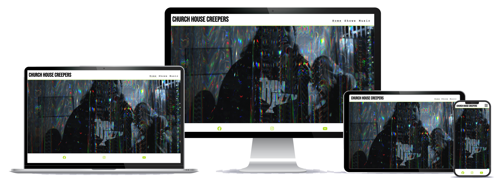
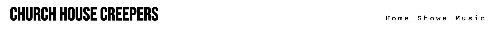
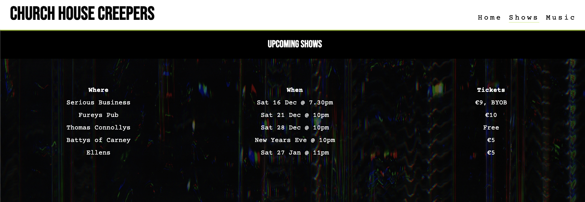
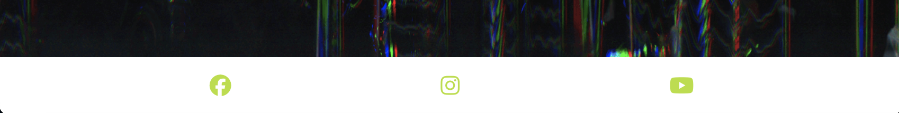
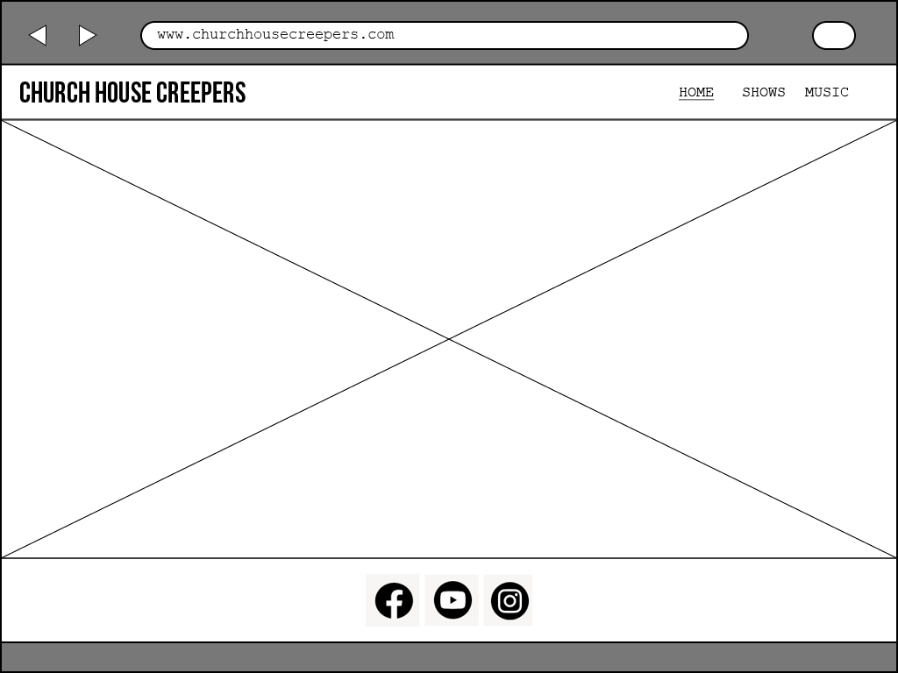
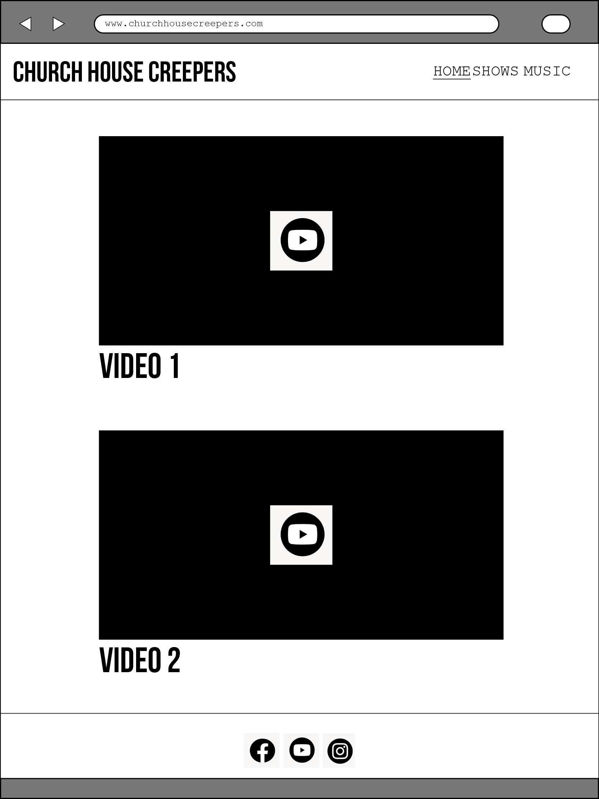
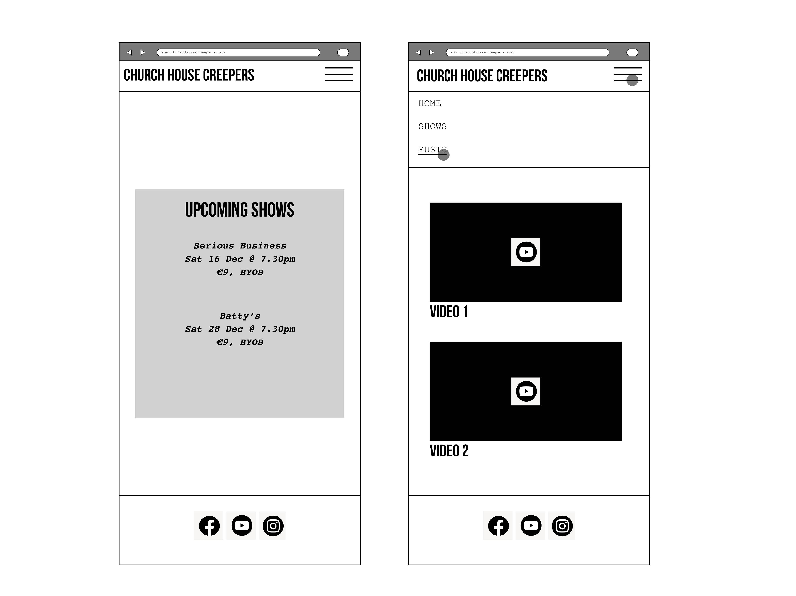
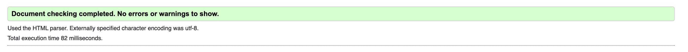
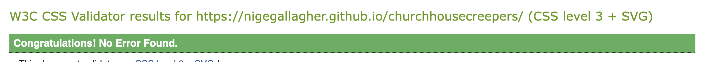

# Church House Creepers

Church House Creepers is a website for an up-and-coming punk band from Sligo, Ireland. The site will be tagerted towards punk and rock music fans who would like to listen to the bands music and keep up-to-date with their upcoming live shows. The site should also give a flavour of the bands style and personality.

## Features 

### Existing Features

- __Navigation Bar__

  - Featured on all three pages, the full responsive navigation bar includes links to the Logo, Home page, Shows and Music page and is identical in each page to allow for easy navigation.
  - This section will allow the user to easily navigate from page to page across all devices without having to revert back to the previous page via the ‘back’ button. 

- __The landing page image__

  - The landing includes a photograph of the band playing live.
  - This section introduces the user to band and gives a sense of thier energy.

Shows 

  - The shows page gives a list of upcoming live shows. 
  - The user will easily keep up-to-date with the bands live.

 Music Section

  - This section will allow the user to listen and watch the bands audio & visual content.
  - This section will be updated as the band release new music and decide what to prioritise.

The Footer

  - The footer section includes links to the relevant social media sites for Love Running. The links will open to a new tab to allow easy navigation for the user. 
  - The footer is valuable to the user as it encourages them to keep connected via social media

## Design

-   ### Imagery
    -   The hero and large background image on the landing page was chosen to immediatly give a sense of the bands grungy style.

-   ### Colour Scheme
    -  A vibrant green was taken from the glitchy image I created in Photoshop to complement the clean, strong blank and white pallete.

-   ### Typography
    -   Google Fonts were used to import Bebas Neue and Courier fonts into styles.css.  These were chosen as they work well together and the Bebas font is punchy and heavy which suits the bands style.

-   ### Wireframes

    -   #### Main Page Wireframes

        

    -   #### Music Page Wireframe

        

    -   #### Shows Page Wireframes

        

## Technologies Used
Adobe Indesign for Wireframes

### Languages Used

-   [HTML5](https://en.wikipedia.org/wiki/HTML5)
-   [CSS3](https://en.wikipedia.org/wiki/Cascading_Style_Sheets)

### Features Left to Implement

- Another feature I would like to add in future would be a shop for band merchandise.

## Testing 

| Test Label           | Steps                                                                           | Expected Outcomes                                            | Result |
| -------------------- | ------------------------------------------------------------------------------- | ------------------------------------------------------------ | ------ |
| Navigation - Nav Bar | Go to main website (home page) and check nav bar links and repeat for all pages | Links work correctly and user is brought to the correct page | Pass   |
| Navigation - social  | Click each social media link on each of the three pages Home, Shows, Music      | Links bring user to correct social media pages               | Pass   |
| UX landing page      | Check main image is responsive                                                  | Image fills screen on various screen sizes                   | Pass   |
| UX shows             | Test tabel and contents on shows page                                           | Information responds to varoius screen sizes and is legible  | Pass   |
| UX music             | Check iFrames are responsive on all videos                                      | Videos respond to various screen sizes                       | Pass   |
| Music page           | Test all video content is displaying correcty                                   | All videos play correctly                                    | Pass   |

### Validator Testing 

- HTML
  - No errors were returned when passing through the official [W3C validator](https://validator.w3.org/nu/?doc=https%3A%2F%2Fnigegallagher.github.io%2Fchurchhousecreepers%2F)

- CSS
  - No errors were found when passing through the official [(Jigsaw) validator](https://jigsaw.w3.org/css-validator/validator?uri=https%3A%2F%2Fnigegallagher.github.io%2Fchurchhousecreepers%2F&profile=css3svg&usermedium=all&warning=1&vextwarning=&lang=en)

### Unfixed Bugs

Currently no unfixed bugs

## Deployment

This section should describe the process you went through to deploy the project to a hosting platform (e.g. GitHub) 

- The site was deployed to GitHub pages. The steps to deploy are as follows: 
  - In the GitHub repository, navigate to the Settings tab 
  - From the source section drop-down menu, select the Master Branch
  - Once the master branch has been selected, the page will be automatically refreshed with a detailed ribbon display to indicate the successful deployment. 

The live link can be found here - https://nigegallagher.github.io/churchhousecreepers/

## Credits 

Tutorial on responsive iFrames: (https://www.w3schools.com/howto/howto_css_responsive_iframes.asp)
Information on media queries (https://www.w3schools.com/css/css_rwd_mediaqueries.asp)

### Content 

The video content is from the bands YouTube channel (https://www.youtube.com/@churchhousecreepers)

### Media

- The photos used on the home page screenshotted on of the bands videos (https://www.youtube.com/watch?v=RB_RxdbMSfw&t=1438s)
- The image was then styeld in Adobe Photoshop

